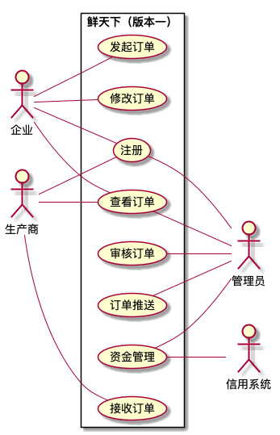
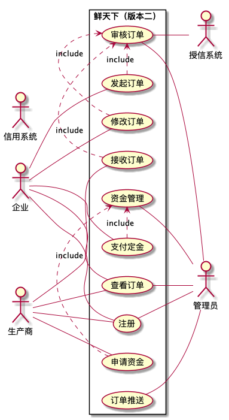

# Analysis & Design of Waterfall System
## 简述

## 1. 需求分析

### 1.1 问题陈述

我们将采用C/S架构，建立一个连接小生产商和大厂家之间的一个中间平台“鲜天下”。通过该平台，我们得以实现这样的目标：聚合小生厂商的生产力以满足大厂家的订单需求，规模化效应减少运行成本，通过通过可靠的授信模型为小生厂商提供合适额度的贷款以解决成本问题。

在大厂家对虾有较大的需求时，通过“鲜天下”平台，大厂家能够在该平台发起订单并支付定金，并实时查看该订单的提交情况与完成情况，如果订单被平台所接受并完成，大厂家需要向平台支付剩余款项。

“鲜天下”平台运行Unix服务器上，能够自动处理用户的请求，并将相关信息存储于{某数据库名称}服务器中。由于这些信息涉及订单与资金流，该数据库系统必须保证内部数据的一致性，以保证平台的资金流正常运转。

平台管理人员对平台所接收到的大厂家订单进行审核，并确定是否接受该订单。若接受该订单，平台需要将该订单拆分成多个小订单，并且推送给合适的小生产商在规定时间内完成。同时，平台还需要监控小生厂商完成情况，并及时收取货物并完成大厂家的订单要求。同时，为了减少更多的小生厂商的生产压力，鼓励更多的小生产家参与到该平台中贡献生产力并获得更高的利润，该平台还会记录小生厂商相关数据，并根据这些数据，智能地判断每个小生产商可得到的信用额度，以让小生厂商获得贷款，同时保证平台资金流的安全与稳定。

小生产商可以在“鲜天下”平台上注册申请成为认证小生产商，并能够从平台中获得订单。完成订单后，还能够从平台中得到相应款项。同时，根据自己需要，小生产商还可以从“鲜天下”平台申请不超过信用额度的贷款，以此来解决成本问题。

该系统的用户与需求有：
1. 小生产商
   1. 注册登陆为小生产商
   1. 从该系统中获得订单（思考形式：是平台分发？用户众筹？）
      1. 接订单
      1. 完成后得到回款
   1. 查看授信情况（子系统？）
      1. 获得贷款
      1. 归还贷款
1. 大生厂商材料采购人员
   1. 注册登陆为大生产商
   1. 发起大订单
   1. 查看订单
      1. 给平台预付款（或付全款）
1. 平台管理人员
   1. 注册登陆为平台管理人员
   1. 审核订单
   1. 查看，管理订单情况
   1. 查看，管理平台资金情况
   1. 查看，管理在平台注册的小生产商的情况

TODO:

### 1.2 用例析取
TODO:[zjh]
1. use case(不太清楚具体怎么弄，搞了两个版本)
    
    

### 1.3 用例规约

TODO:[lmh]
1. 明确功能性需求
2. 参考老师的文档以及ppt内容，和lmh合作完成归约部分，主要完成用例规约。
3. 需要画一些活动图

### 1.4 补充规约
TODO:[zjh]

1. 明确非功能性需求
1. 参考老师的文档以及ppt内容，和lmh合作完成归约部分，主要完成补充规约。

### 1.5 术语表
TODO:[lmh]
1. 要检查一下上面的文字，统一一下术语（如之前我提到的小生厂商，大厂家这类术语如果需要修改的话，在术语表写清楚，并且修改一下上面的内容。
1. 表格格式老师上课有说，我不是很记得了，就找了ppt上的格式。

| 术语 | 含义 |
|--|--|
| TODO | TODO |
| TODO | TODO |
| TODO | TODO |

### 评分标准（我copy过来的，方便参考）

•	UML图绘制准确，在Usecase Diagram 和 Activity Diagram 中画错一处扣一分；
•	设计的功能符合客户合理要求，设计的功能性需求明显考虑不周的-2；
•	补充规约应充分考虑到相关系统所需要的非功能需求，考虑不周到-2；
•	术语表应尽量涵盖系统所需要的实体（类）（Entity Class），在后续的实体类设计中，如果实体类的数量大于术语个数3个或者以上，-2；
•	问题陈述存在3处或以上中文语法错误的-2；
•	问题陈述中没有介绍清晰与本系统相关的其它系统的-2；
•	用例图与问题陈述表达的场景不完全一致的-2；
•	排版不规范，缺少封面、目录，没有用文档结构的，每种情况-2；
•	写出3-5个用例规约，不够3个的-3
•	用例规约中流程写的不够详尽导致没办法编码的，每个错误-1；
•	至少有一处能够体现面向对象的方法论的“单一职责原则”(Single Responsibility Principle, SRP)，否则-3
•	至少有一处能体现面向对象方法论的“开闭原则”(Open-Close-Principle, OCP) ，否则-3
•	体现数据可扩展，有此功能+2
•	体现功能需求可扩展，有此功能+2
•	从用户方面扩展，多用户使用能出现什么问题，你的项目可以解决，有此功能+3
•	怎么让用户喜欢这软件？有此功能+3
•	来自亚非拉的用户怎样支持，有此功能+3
•	恶意的用户，如何保证安全，有此功能+3
•	从软件构建方面扩展，可以移到另外平台（数据库、操作系统），有此功能+3
•	软件由多个语言写的不同模块，如何定义彼此的接口，有此功能+3
•	软件已经在服务，如何升级，有此功能+3
•	上个学期，计算机综合实践课程中，腾讯 T 4 Victory Huang 的课程，希望大家用到本学期项目中，有此功能或者非功能+5

## 2. 架构设计

TODO:[yb+hgl]
1. 我觉得这个需要一起写？分得太开好像不好分工。
1. 明确技术栈，这个你们讨论过了应该会比较熟悉，目前大体方向是网页，具体细节你们看看吧？

### 2.1 架构描述
TODO:[hgl]
比较简单，参考ppt即可

### 2.2 架构图
TODO:[yb]
比较简单，参考ppt即可

### 2.3 关键抽象
TODO:[yb+hgl]
1. 这一个我觉得比较重点，需要考虑部分实现细节。
1. ppt中如此描述：“关键抽象即为找到系统实体类的过程。实体类为系统中存储和改动的数据，可以从需求分析中的术语表中得到。经过分析，本系统有三个实体类，分别为用户表，活动表和报名表，用户表存储了与用户相关的一切信息，包含用户名、密码、入学年份等，活动表包含了活动名称、活动时间、活动人数等信息，报名表包含了活动名称、报名情况等信息。”
1. ppt还描述：存储和修改的数据类。
1. 这一部分要写的内容主要是(以下是我的理解)：
   1. 实体---需要维护的数据表
   1. 其他的我暂时没想清楚，老师文档中画了类图，但是ppt里没有。我觉得，需要先想一想系统中会有哪些类以及这些类对数据的操作画一些简单的类图，下一周问问老师这部分要怎么写比较好。

### 评分标准（我copy过来的，方便参考）

•	没有架构描述的-2；
•	架构描述与架构图不一致的-5
•	架构图不符合UML规范，每个错误-1；用包、虚线带箭头、顺序等方面；
•	没有关键抽象类图的-5；
•	关键抽象类图不符合UML规范的，每种错误-1；类名称、类的类型；
•	图和表排版不规范，没有名称、编号，或者名称和编号混乱、图和表中的字体字形字号不对等，每个错误-1；
•	如果采用框架，应在架构图中体现出来，每个不一致情况-1；
•	编程框架应与架构图一致，每个不一致-1；

## 3. 用例分析

TODO:
### 3.1 补充用例规约

TODO:
### 3.2 用例中类的析取

TODO:
### 3.3 分析机制

TODO:
### 3.4 合并分析类

TODO:
## 4. 子系统及其接口设计

TODO:
### 4.1 确定设计类

TODO:
### 4.2 定义子系统

TODO:
### 4.3 定义接口

TODO:
### 4.4 确定可重用子系统

TODO:
## 5. 部件设计

TODO:
### 5.1 分析并发需求

TODO:
### 5.2 针对某个需求的设计方案

TODO:
### 5.3 生命周期

TODO:
### 5.4 映射到现实系统

TODO: