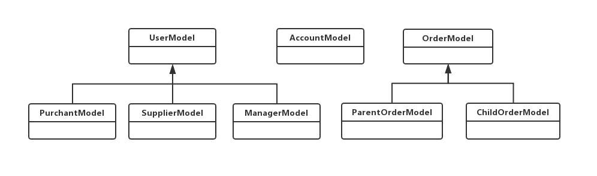

# Analysis & Design of Waterfall System
## 简述

## 1. 需求分析

### 1.1 问题陈述


我们将采用C/S架构，建立一个连接小生产商和大厂家之间的一个中间平台“鲜天下”。通过该平台，我们得以实现这样的目标：聚合小生厂商的生产力以满足大厂家的订单需求，规模化效应减少运行成本，通过通过可靠的授信模型为小生厂商提供合适额度的贷款以解决成本问题。

在大厂家对虾有较大的需求时，通过“鲜天下”平台，大厂家能够在该平台发起订单并支付定金，并实时查看该订单的提交情况与完成情况，如果订单被平台所接受并完成，大厂家需要向平台支付剩余款项。

小生产商可以在“鲜天下”平台上注册申请成为认证小生产商，并能够从平台中获得订单。完成订单后，还能够从平台中得到相应款项。同时，根据自己需要，小生产商还可以从“鲜天下”平台申请不超过信用额度的贷款，以此来解决成本问题。

为确保大小生产商之间的协作安全，平台管理人员会对平台所接收到的大厂家订单进行审核，并确定是否接受该订单。若接受该订单，平台需要将该订单拆分成多个小订单，并且推送给合适的小生产商在规定时间内完成。同时，平台还需要监控小生厂商完成情况，并及时收取货物并完成大厂家的订单要求。为了减少更多的小生厂商的生产压力，鼓励更多的小生产家参与到该平台中贡献生产力并获得更高的利润，该平台还会记录小生厂商相关数据，并根据这些数据，智能地判断每个小生产商可得到的信用额度，以让小生厂商获得贷款，同时保证平台资金流的安全与稳定。

“鲜天下”平台运行Unix服务器上，能够自动处理用户的请求，并将相关信息存储于数据库中。由于这些信息涉及订单与资金流，该数据库系统必须保证内部数据的一致性，以保证平台的资金流正常运转。

<!-- 该系统的用户与需求有：
1. 小生产商
   1. 注册登陆为小生产商
   1. 从该系统中获得订单（思考形式：是平台分发？用户众筹？）
      1. 接订单
      1. 完成后得到回款
   1. 查看授信情况（子系统？）
      1. 获得贷款
      1. 归还贷款
1. 大生厂商材料采购人员
   1. 注册登陆为大生产商
   1. 发起大订单
   1. 查看订单
      1. 给平台预付款（或付全款）
1. 平台管理人员
   1. 注册登陆为平台管理人员
   1. 审核订单
   1. 查看，管理订单情况
   1. 查看，管理平台资金情况
   1. 查看，管理在平台注册的小生产商的情况 -->

### 1.2 用例析取

TODO: 我改申请供应额度


### 1.3 用例规约
##### 1.3.1 登录
1) 简要说明

```
本用例描述订购商/微供应商/管理员如何登录到鲜天下平台
```

2) 参与者
```
订购商, 微供应商, 管理员, 以下简称用户
```

3) 事件流
    
```
i. 基本事件流
    本用例开始于用户希望登录到鲜天下平台
    a) 系统请求用户输入用户名和密码
    b) 用户输入用户名和密码
    c) 系统验证用户输入的用户名和密码
        c-1) 用户名不存在
        c-2) 用户被锁定
        c-3) 用户名对应的密码不正确
    d) 用户成功登录到主界面并进行其它操作
    
ii. 后备事件流
    
    c-1) 用户名不存在
        1> 系统显示错误信息 "用户名不存在或密码错误, 超过5次后锁定"
        2> 返回事件流第一步
    
    c-2) 用户被锁定
        1> 系统显示错误信息 "用户被锁定, 请联系客服申诉处理"
        2> 返回事件流第一步
                    
    c-3) 用户名对应的密码不正确
        1> 系统显示错误信息 "用户名不存在或密码错误, 超过5次后锁定"
        2> 系统将用户错误的登录尝试次数 +1
        3> 检查登录尝试次数是否超过上限, 超过则锁定用户并发送通知短信
        4> 返回事件流第一步
```

4) 特殊需求
```
密码输入框必须以密文方式呈现
```

5) 前置条件
```
用例开始前, 用户需要打开对应的系统登录界面, 且用户处于未登录状态
```

6) 后置条件
```
如果用例成功, 系统状态转换为登录态. 若失败, 系统状态不改变
```

##### 1.3.2 提交母订单

TODO:lmh

1) 简要说明
```
本用例描述订购商如何向鲜天下平台提交新订单
```

2) 参与者
```
订购商
```

3) 事件流
    

```
i. 基本事件流

    本用例开始于处于登录态的订购商向鲜天下平台申请订购货物
    a) 用户输入需要虾的数量, 配送地点和配送方式
        选择配送地点过程为: 系统显示可选地点列表, 用户
        依次点选省, 市, 区, 系统显示的可选地点列表层级也从
        省,下降到是市,最后到区. 用户最后需手动输入街道地址.
        系统会在用户的输入面板上方列出用户使用的过往完整地址,
        用户可以点击历史地址来一次性完成地址输入.
        
        选择配送方式为点选系统提供的几种可选配送方式之一, 
        选择后配送方式其它选项变为不可选状态.
    b) 系统检测用户的输入是否合法 
        b-1) 客户请求的虾数量不在余量范围内
        b-2) 客户没有输入完整的地址
        b-3) 客户没有选择配送方式
    c) 用户选择确认当前信息继续进行预约或取消交易
        c-1) 用户选择取消
    d) 用户选择订金交付方式, 选项包括: 立即交付定金, 请求人工面谈,
        若用户选择立即交付定金, 则转入支付页面, 填写支付信息 
        (如稅号和公司抬头等), 若用户选择请求人工面谈, 则请求用户
        填写公司联系人信息并预约会谈时间
        d-1) 用户选择取消
    e) 预订结束, 订单被提交
    
ii. 后备事件流
    b-1) 客户请求的虾数量不在余量范围内
        1> 系统显示错误信息 "您申请的商品余量不足"
        2> 返回事件流a步
    
    b-2) 客户没有输入完整的地址
        1> 系统显示错误信息 "您没有输入完整的地址"
        2> 返回事件流a步
   
    b-3) 客户没有选择配送方式
        1> 系统显示错误信息 "您没有选择配送方式"
        2> 返回事件流a步
    
    c-1) 用户选择取消
        1> 进入事件流a步
     
    d-1) 用户选择取消
        1> 进入事件流a步
```

4) 特殊需求
```
无
```

5) 前置条件
```
用例开始前, 用户需要处于已登录状态下, 并打开交易界面 
```

6) 后置条件
```
如果用例成功, 用户提交的订单被保存为预订态或取消态, 预订态的订单需保存在数据库中, 
取消态的订单直接丢弃, 在接受到用户的定金转账后 (无论是立即交付定金/人工面谈后交付定金),
订单状态均切换为待完成态.
```

##### 1.3.3 查看母订单信息

TODO: wyf

1) 简要说明
```
本用例描述订购商或管理员如何查看订单的信息
```

2) 参与者
```
订购商, 管理员
```

3) 事件流
    
```
i. 基本事件流

    本用例开始于处于登录态的订购商或管理员向鲜天下平台请求订单信息
    a) 系统读取用户设置的订单过滤器的值
    b) 系统向平台发送过滤器, 平台返回相关订单状态
    c) 系统显示订单数据
```

4) 特殊需求
```
无
```

5) 前置条件
```
用例开始前, 用户需要处于已登录状态下, 并打开订单信息界面, 同时刚刚执行了一次请求指令
```

6) 后置条件
```
无
```

##### 1.3.4 查看子订单分派信息

TODO : wyf

1) 简要说明
```
本用例描述管理员如何查看子订单的分派信息
```

2) 参与者
```
管理员
```

3) 事件流
    
```
i. 基本事件流

    本用例开始于处于登录态的管理员向鲜天下平台请求订单信息
    a) 系统读取用户设置的订单过滤器的值
    b) 系统向平台发送过滤器, 平台返回相关订单状态
    c) 系统根据过滤器筛选订单并显示
```
4) 特殊需求
```
无
```

5) 前置条件
```
用例开始前, 用户需要处于已登录状态下, 并打开订单信息界面, 同时刚刚执行了一次请求指令
```

6) 后置条件
```
无
```

##### 1.3.5 审核订购商

TODO: lmh

1) 简要说明
```
本用例描述管理员如何审核订购商的资质
```

2) 参与者
```
管理员
```

3) 事件流
    
```
i. 基本事件流
    本用例开始于处于登录态的管理员向鲜天下请求待检查的订购商队列
    a) 系统读取待检查的订购商队列
    b) 系统读取管理员选择的订购商并显示信息
    c) 系统请求管理员决定是否通过, 若管理员同意通过,则将订购商帐
        号标记为验证通过, 同时向订购商填写的邮件地址发送验证成功邮件.
        若管理员否决, 则将订购商帐号标记为验证不通过, 同时向订购
        商填写的邮件地址发送验证失败邮件
    d) 从队列中移除订购商请求, 回到事件流a
```

4) 特殊需求
```
无
```

5) 前置条件
```
用例开始前, 管理员需要处于已登录状态下, 并打开订购商信息界面
```

6) 后置条件
```
无
```

##### 1.3.6 审核微供应商

TODO:lmh

1) 简要说明
```
本用例描述管理员如何审核微供应商的资质
```

2) 参与者
```
管理员
```

3) 事件流
    
```
i. 基本事件流
    本用例开始于处于登录态的管理员向鲜天下请求待检查的微供应商队列
    a) 系统读取待检查的微供应商队列
    b) 系统读取管理员选择的微供应商并显示信息
    c) 系统请求管理员决定是否通过, 若管理员同意通过,则将微供应商帐
       号标记为验证通过, 同时向微供应商填写的邮件地址发送验证成功邮件.
       若管理员否决, 则将微供应商帐号标记为验证不通过, 同时向订购
       商填写的邮件地址发送验证失败邮件
    d) 从队列中移除微供应商请求, 回到事件流a
```

4) 特殊需求

```
无
```

5) 前置条件
```
用例开始前, 管理员需要处于已登录状态下, 并打开微供应商信息界面
```

6) 后置条件
```
无
```

##### 1.3.7 生产资格认证
1) 简要说明
```
本用例描述微供应商如何申请生产资格认证
```

2) 参与者
```
微供应商
```

3) 事件流
    
```
i. 基本事件流
    本用例开始于处于登录态的微供应商向鲜天下申请生产资格认证
    a) 检查用户是否已经经过验证和是否有处理中的验证
        a-1) 尚未验证且没有处理中的验证
        a-2) 其它
ii. 后备事件流
    a-1) 满足条件
        1> 请求微供应商输入验证信息
        2> 将请求发送到平台
        3> 平台将请求分派到活动管理员
        4> 将用户标记为验证处理中
    a-2) 不满足条件
        1> 显示申请失败和申请失败的原因
```

4) 特殊需求
```
无
```

5) 前置条件
```
用例开始前, 微供应商需要处于已登录状态下, 并打开微供应商申请验证界面
```

6) 后置条件
```
无
```

##### 1.3.8 购买资格认证

TODO：增加填写生产力

1) 简要说明
```
本用例描述微供应商如何申请生产资格认证
```

2) 参与者
```
微供应商
```

3) 事件流
    
```
i. 基本事件流
    本用例开始于处于登录态的订购商向鲜天下申请购买资格认证
    a) 检查用户是否已经经过验证和是否有处理中的验证
        a-1) 尚未验证且没有处理中的验证
        a-2) 其它
ii. 后备事件流
    a-1) 尚未验证且没有处理中的验证
        1> 请求订购商输入验证信息
        2> 将请求发送到平台
        3> 平台将请求分派到活动管理员
        4> 将用户标记为验证处理中
    a-2) 其它
        1> 显示申请失败和申请失败的原因
```

4) 特殊需求
```
无
```

5) 前置条件
```
用例开始前, 订购商需要处于已登录状态下, 并打开订购商申请验证界面
```

6) 后置条件
```
无
```

##### 1.3.9 绑定银行帐号
1) 简要说明
```
本用例描述微供应商如何绑定银行帐号
```

2) 参与者
```
微供应商
```

3) 事件流
    
```
i. 基本事件流
    本用例开始于处于登录态的微供应商向鲜天下请求绑定银行帐号
    a) 请求用户输入待绑定的银行信息
    b) 将信息发送到平台进行验证
        b-1) 支付信息合法
        b-2) 支付信息不合法
ii. 后备事件流
    b-1) 支付信息合法
        1> 保存支付信息到数据库;
        2> 显示绑定成功;
    a-2) 支付信息不合法
        1> 显示绑定失败
```

4) 特殊需求
```
无
```

5) 前置条件
```
用例开始前, 微供应商需要处于已登录状态下, 并打开微供应商银行帐号界面, 且微供应商银行帐号处于未绑定状态
```

6) 后置条件
```
无
```

##### 1.3.10 申请供应额度

TODO: wyf 避免变现

1) 简要说明

```
本用例描述微供应商如何申请一个配额订单
```

2) 参与者
```
微供应商
```

3) 事件流
    
```
i. 基本事件流
    本用例开始于处于登录态的微供应商向鲜天下申请一个配额订单
    a) 请求用户输入所需额度
    b) 检查请求额度是否小于等于总额度
        b-1) 请求额度小于等于总额度
        b-2) 请求额度大于总额度
    c) 请求用户确认
        c-1) 用户确认
        c-2) 用户取消
    
ii. 后备事件流
    b-1) 请求额度小于等于总额度
        1> 转至事件流c步
    b-2) 请求额度大于总额度
        1> 显示申请失败
    c-1) 用户确认
        1> 扣除申请配额
        2> 保存订单
        3> 显示申请成功
    c-2> 用户取消
        3> 显示申请取消
```

4) 特殊需求
```
无
```

5) 前置条件
```
用例开始前, 微供应商需要处于已登录状态下, 并打开微供应商申请配额界面
```


##### 1.3.11 查看派发子订单
1) 简要说明

```
本用例描述微供应商如何查看被分派的子订单
```

2) 参与者

```
微供应商
```

3) 事件流
       

```
i. 基本事件流

    本用例开始于处于登录态的管理员向鲜天下平台请求订单信息
    a) 用户提交查看订单的请求
    b) 系统读取分派给微供应商的所有订单
    c) 系统显示所有订单详情
    
```

4) 特殊需求

```
无
```

5) 前置条件

```
用例开始前, 用户需要处于已登录状态下, 并打开订单信息界面
```

6) 后置条件

```
无
```

##### 

##### 1.3.12 取消子订单

1) 简要说明

```
本用例描述微供应商取消被分派订单的流程
```

2) 参与者

```
微供应商、资金系统
```

3) 事件流
        

```
i. 基本事件流

    本用例开始于处于登录态的微供应商向鲜天下平台处理子订单后的界面
    a) 微供应商向平台发送取消子订单的请求
    b) 平台向资金系统转发请求
    c) 资金系统同意取消订单
    d）在数据库中更改子订单相关信息
    
ii. 后备事件流
    
    c-1) 资金系统不同意取消订单
        1> 系统显示错误信息 "订单不满足取消条件，无法取消"
        2> 退出事件流
      
```

4) 特殊需求

```
无
```

5) 前置条件

```
用例开始前, 用户需要处于已登录状态下, 并打开订单信息界面, 同时刚刚执行了一次查看子订单请求指令
```

6) 后置条件

```
无
```

##### 

##### 1.3.13 提交完成子订单

1) 简要说明

```
本用例描述微供应商和资金系统完成子订单的提交
```

2) 参与者

```
微供应商、资金系统
```

3) 事件流
    

```
i. 基本事件流

    本用例开始于处于登录态的微供应商向鲜天下平台处理子订单后的界面
    a) 微供应商向平台发送提交子订单的请求
    b) 平台向资金系统转发请求
    c) 资金系统确认子订单的提交
    d）平台在数据库中更改子订单相关信息（包括子订单、母订单信息）
    
ii. 后备事件流
    
    c-1) 资金系统不同意提交子订单
        1> 系统显示错误信息 "订单不满足提交条件，无法提交"
        2> 退出事件流
      
```

4) 特殊需求

```
无
```

5) 前置条件

```
用例开始前, 用户需要处于已登录状态下, 并打处理子订单信息界面，同时刚刚执行了一次查看子订单请求指令
```

6) 后置条件

```
无
```

### 1.4 "鲜天下"平台实现补充规约

TODO: zjh 安全性，可行性，等相关说明需要细化

#### 1.4.1 目标

补充规约列出了不便于在用例模型的用例中获取的系统需求。补充规约用例模型一起记录关于系统的一整套需求。


#### 1.4.2 范围

+ 本补充规约适用于"鲜天下"交易系统，将要由学习面向对象软件分析与设计的学生开发。

+ 本规约除定义了在许多用例中所共有的功能性需求以外，还定义了系统的非功能性需求，例如：可靠性、可用性、性能和可支持性等。（功能性需求在用例规约中定义。）


#### 1.4.3 功能

+ 平台能够在管理员进行订单处理时给出可行方案、方便管理员进行订单的拆分和分派。
+ 订单一旦被拆分或分派出去，就不允许再被修改
+ 生产商注册时默认无条件接受平台的分派，否则注册时应在相关信息填写好所能接受的供货范围与供货量。


#### 1.4.4 可行性

[TODO]


#### 1.4.5 可靠性

"鲜天下"交易平台应该在每周七天，每天二十四小时内都应是可以使用的。宕机的时间应少于 5%。


#### 1.4.6 性能

+ 在任意既定时刻，系统最多可支持2000名用户同时使用中央数据库，并在任意时刻最多可支持500***名用户同时使用本地服务器。
+ 服务器的平均响应时间不能超过1秒。
+ "鲜天下"交易平台对任何操作的处理事件不得超过1分钟。


#### 1.4.7 安全性

+ 平台必须能防止他人在没有权限的情况下修改企业发布的订单。
+ 能够防止恶意访问操作。
+ 只有管理员才能进行订单的处理。


### 1.5 术语表

| 编号 | 术语 | 含义 | 备注 |
|-----|-----|------|------|
| 1 | 微供应商 | 生产虾的微小供应商, 为平台上实际货物的生产者 |
| 2 | 订购商 | 购买虾的订购商, 为平台上实际货物的购买者 |
| 3 | 平台 | 连接微供应商和订购商的桥梁, 负责订单派发, 资金分派, 物流等功能 | |


### 评分标准（我copy过来的，方便参考）

•	UML图绘制准确，在Usecase Diagram 和 Activity Diagram 中画错一处扣一分；
•	设计的功能符合客户合理要求，设计的功能性需求明显考虑不周的-2；
•	补充规约应充分考虑到相关系统所需要的非功能需求，考虑不周到-2；
•	术语表应尽量涵盖系统所需要的实体（类）（Entity Class），在后续的实体类设计中，如果实体类的数量大于术语个数3个或者以上，-2；
•	问题陈述存在3处或以上中文语法错误的-2；
•	问题陈述中没有介绍清晰与本系统相关的其它系统的-2；
•	用例图与问题陈述表达的场景不完全一致的-2；
•	排版不规范，缺少封面、目录，没有用文档结构的，每种情况-2；
•	写出3-5个用例规约，不够3个的-3
•	用例规约中流程写的不够详尽导致没办法编码的，每个错误-1；
•	至少有一处能够体现面向对象的方法论的“单一职责原则”(Single Responsibility Principle, SRP)，否则-3
•	至少有一处能体现面向对象方法论的“开闭原则”(Open-Close-Principle, OCP) ，否则-3
•	体现数据可扩展，有此功能+2
•	体现功能需求可扩展，有此功能+2
•	从用户方面扩展，多用户使用能出现什么问题，你的项目可以解决，有此功能+3
•	怎么让用户喜欢这软件？有此功能+3
•	来自亚非拉的用户怎样支持，有此功能+3
•	恶意的用户，如何保证安全，有此功能+3
•	从软件构建方面扩展，可以移到另外平台（数据库、操作系统），有此功能+3
•	软件由多个语言写的不同模块，如何定义彼此的接口，有此功能+3
•	软件已经在服务，如何升级，有此功能+3
•	上个学期，计算机综合实践课程中，腾讯 T 4 Victory Huang 的课程，希望大家用到本学期项目中，有此功能或者非功能+5


## 2. 架构设计

TODO:[yb+hgl]
1. 我觉得这个需要一起写？分得太开好像不好分工。
1. 明确技术栈，这个你们讨论过了应该会比较熟悉，目前大体方向是网页，具体细节你们看看吧？

### 2.1 架构描述
TODO:[hgl]
比较简单，参考ppt即可

### 2.2 架构图

如图所示。

### 2.3 关键抽象
TODO:[yb+hgl]



<!-- 1. 这一个我觉得比较重点，需要考虑部分实现细节。
2. ppt中如此描述：“关键抽象即为找到系统实体类的过程。实体类为系统中存储和改动的数据，可以从需求分析中的术语表中得到。经过分析，本系统有三个实体类，分别为用户表，活动表和报名表，用户表存储了与用户相关的一切信息，包含用户名、密码、入学年份等，活动表包含了活动名称、活动时间、活动人数等信息，报名表包含了活动名称、报名情况等信息。”
3. ppt还描述：存储和修改的数据类。
4. 这一部分要写的内容主要是(以下是我的理解)：
   1. 实体---需要维护的数据表
   2. 其他的我暂时没想清楚，老师文档中画了类图，但是ppt里没有。我觉得，需要先想一想系统中会有哪些类以及这些类对数据的操作画一些简单的类图，下一周问问老师这部分要怎么写比较好。 -->


### 评分标准（我copy过来的，方便参考）

•	没有架构描述的-2；
•	架构描述与架构图不一致的-5
•	架构图不符合UML规范，每个错误-1；用包、虚线带箭头、顺序等方面；
•	没有关键抽象类图的-5；
•	关键抽象类图不符合UML规范的，每种错误-1；类名称、类的类型；
•	图和表排版不规范，没有名称、编号，或者名称和编号混乱、图和表中的字体字形字号不对等，每个错误-1；
•	如果采用框架，应在架构图中体现出来，每个不一致情况-1；
•	编程框架应与架构图一致，每个不一致-1；


## 3. 用例分析

TODO:
### 3.1 补充用例规约

TODO:
### 3.2 用例中类的析取

TODO:
### 3.3 分析机制

TODO:
### 3.4 合并分析类

TODO:
## 4. 子系统及其接口设计

TODO:
### 4.1 确定设计类

TODO:
### 4.2 定义子系统

TODO:
### 4.3 定义接口

TODO:
### 4.4 确定可重用子系统

TODO:
## 5. 部件设计

TODO:
### 5.1 分析并发需求

TODO:
### 5.2 针对某个需求的设计方案

TODO:
### 5.3 生命周期

TODO:
### 5.4 映射到现实系统

TODO: